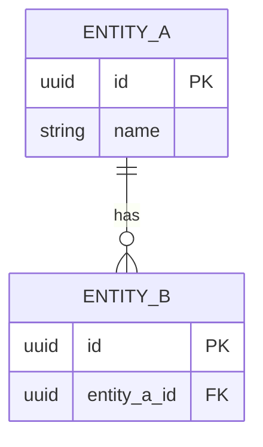

# Data Architecture — {{PROJECT_NAME}}

> How data is structured, owned and governed. Entities use the `DM-` prefix and
> `implements` the functional requirements (`FR-*`) whose data they hold. Proposed by
> `data-architect`, written by `artifact-manager`.

## Legend

- **Store**: `relational` | `document` | `key-value` | `object` | `cache` | `search`
- **Classification**: `public` | `internal` | `confidential` | `pii` | `pci`
- **Status**: `draft` | `in-review` | `approved` | `removed`

## 1. Logical Data Model (ERD)

## 2. Entities

| ID | Entity | Store | Classification | implements | Status |
|------|--------|-------|----------------|------------|--------|
| DM-001 | _..._ | relational | internal | FR-001 | draft |

## 3. Physical Design Notes

_Primary keys, indexing strategy, partitioning/sharding, and referential integrity._

## 4. Data Retention & Purging

| Data domain | Retention period | Purge mechanism | Driver (NFR/regulation) |
|-------------|------------------|-----------------|-------------------------|
| _..._ | _..._ | _..._ | NFR-001 |

## 5. Data Sovereignty & Residency

_Where data must physically reside (e.g. Canada-only regions) and why._

## Changelog

<!-- artifact_tools changelog appends here -->
- {{DATE}} — v0.1 — Initial scaffold (phase 2).
