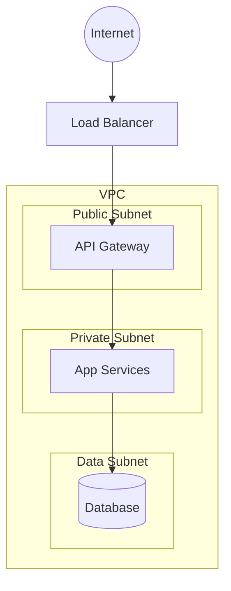

# Deployment Topology — {{PROJECT_NAME}}

> How the software runs in the cloud: networks, environments, and recovery. Nodes use
> the `DEP-` prefix and `mitigates` the operational non-functional requirements
> (`NFR-*`) they address. Proposed by `platform-architect`, written by
> `artifact-manager`.

## Legend

- **Zone**: `public` | `private` | `data` | `management`
- **Status**: `draft` | `in-review` | `approved` | `removed`

## 1. Network Topology

## 2. Topology Nodes

| ID | Node | Zone | Runtime | mitigates | Status |
|------|------|------|---------|-----------|--------|
| DEP-001 | _..._ | private | container | NFR-001 | draft |

## 3. Environments

| Environment | Purpose | Scale | Promotion gate |
|-------------|---------|-------|----------------|
| Dev | _..._ | minimal | PR merge |
| QA | _..._ | minimal | tests pass |
| Staging | _..._ | prod-like | sign-off |
| Prod | _..._ | full | change approval |

## 4. CI/CD & Infrastructure as Code

- **Pipeline**: _build → test → scan → deploy stages._
- **IaC**: _Terraform / Ansible — module layout and state management._
- **Promotion**: _how artifacts move Dev → QA → Staging → Prod._

## 5. Disaster Recovery

| Metric | Target | Implementation |
|--------|--------|----------------|
| RTO | _..._ | _..._ |
| RPO | _..._ | _..._ |

_Backups, replication, failover region, and restore drills. Targets derive from
`NFR-*` reliability requirements._

## Changelog

<!-- artifact_tools changelog appends here -->
- {{DATE}} — v0.1 — Initial scaffold (phase 2).
