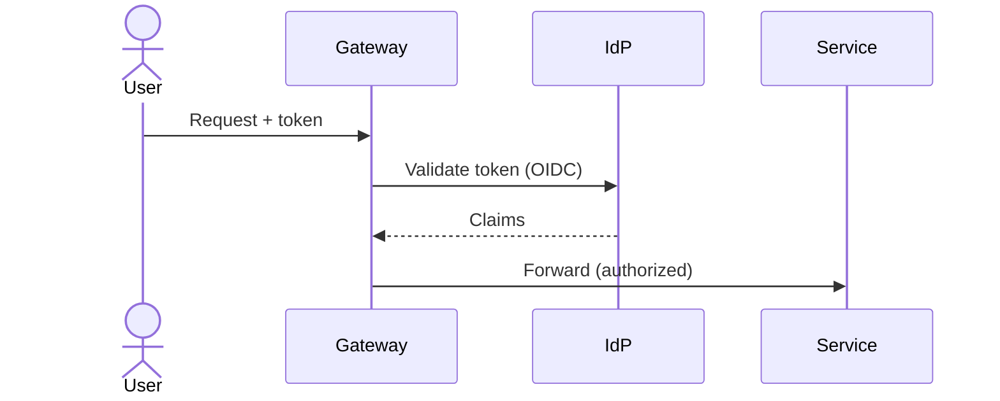
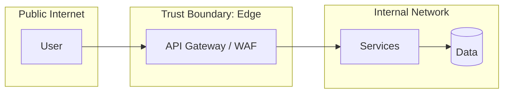

# Security Architecture — {{PROJECT_NAME}}

> Threat model, identity, and data protection. Controls use the `SEC-` prefix and
> `mitigates` the security non-functional requirements (`NFR-*`) they address.
> Proposed by `security-architect`, written by `artifact-manager`.

## Legend

- **Domain**: `iam` | `data-protection` | `network` | `app-sec` | `logging` | `compliance`
- **Status**: `draft` | `in-review` | `approved` | `removed`

## 1. Data Classification

| Data domain | Classification | At rest | In transit |
|-------------|----------------|---------|------------|
| _..._ | pii | AES-256 | TLS 1.3 |

> Classification levels: `public`, `internal`, `confidential`, `pii`, `pci`.

## 2. Identity & Access Management (IAM)

- **Authentication**: _OIDC / OAuth2 / SAML — provider and flow._
- **Authorization**: _RBAC / ABAC — roles, scopes, policy enforcement point._
- **Token handling**: _JWT validation location, lifetime, rotation._

## 3. Trust Boundaries

## 4. Security Controls

| ID | Domain | Control | mitigates | Status |
|------|--------|---------|-----------|--------|
| SEC-001 | iam | _..._ | NFR-001 | draft |

## 5. Threat Model (STRIDE summary)

| Threat | Asset | Vector | Control (SEC) |
|--------|-------|--------|---------------|
| Spoofing | _..._ | _..._ | SEC-001 |

## Changelog

<!-- artifact_tools changelog appends here -->
- {{DATE}} — v0.1 — Initial scaffold (phase 2).
