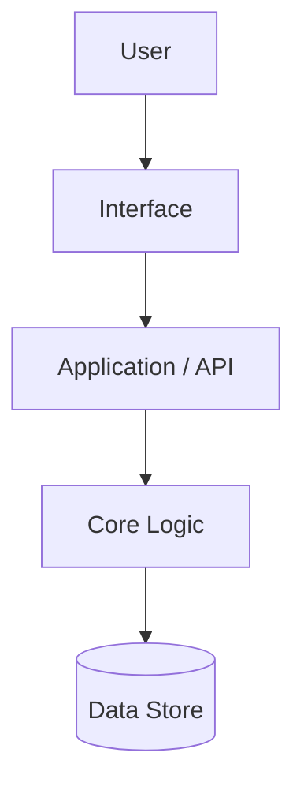

# System Blueprint — {{PROJECT_NAME}}

> Architecture, components, and data flow. Components use the `BP-` prefix and declare
> which functional requirements they `satisfies`. Owned by `architecture` (proposed)
> and written by `artifact-manager`.

## 1. Architecture Overview

## 2. Components

| ID | Component | Responsibility | satisfies | Status |
|------|-----------|----------------|-----------|--------|
| BP-001 | _..._ | _..._ | FR-001 | draft |

## 3. Data Flow

_Describe the key flows: what data moves where, and when._

## 4. Technology Decisions

| Decision | Choice | Rationale | Alternatives considered |
|----------|--------|-----------|-------------------------|
| _..._ | _..._ | _..._ | _..._ |

## 5. Cross-cutting Concerns

_Security, observability, error handling, scaling. Reference relevant `NFR-*` ids._

## Changelog

<!-- artifact_tools changelog appends here -->
- {{DATE}} — v0.1 — Initial scaffold (phase 1).
