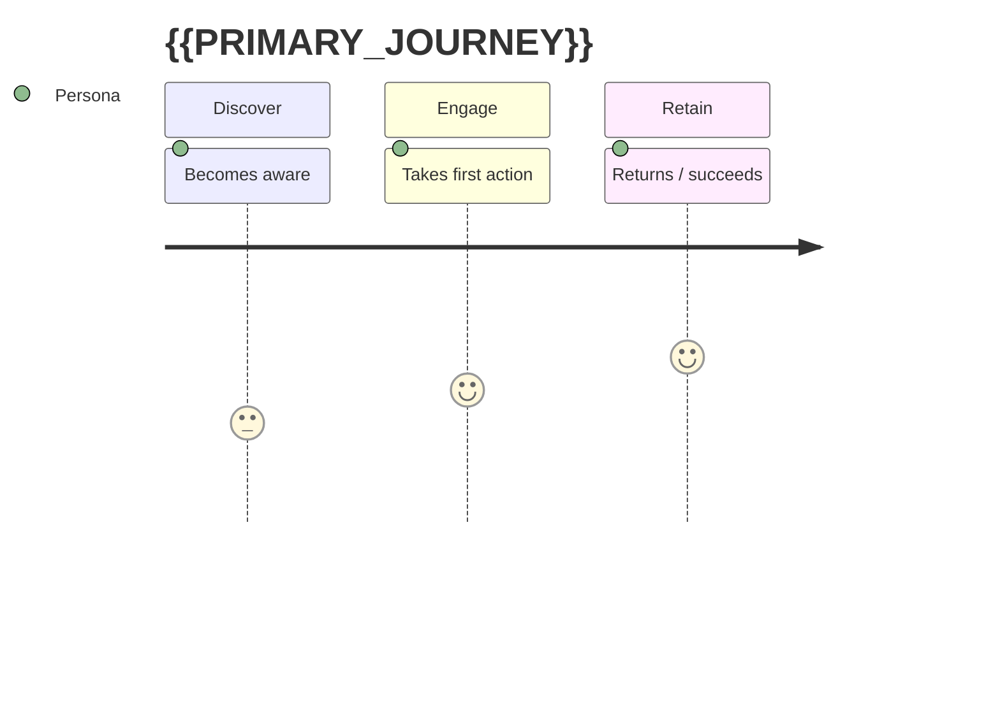

# User Journey Map — {{PROJECT_NAME}}

> Personas and their end-to-end journeys. Journey steps use the `UJ-` prefix and are
> referenced by functional requirements via `traces_to`.

## Personas

| Persona | Description | Primary goal | Pain points |
|---------|-------------|--------------|-------------|
| _..._ | _..._ | _..._ | _..._ |

## Journey: {{PRIMARY_JOURNEY}}

## Journey steps

| ID | Stage | User action | System response | Emotion | Opportunity |
|------|-------|-------------|-----------------|---------|-------------|
| UJ-001 | Discover | _..._ | _..._ | 🙂 | _..._ |
| UJ-002 | Engage | _..._ | _..._ | 😐 | _..._ |

## Changelog

<!-- artifact_tools changelog appends here -->
- {{DATE}} — v0.1 — Initial scaffold (phase 1).
