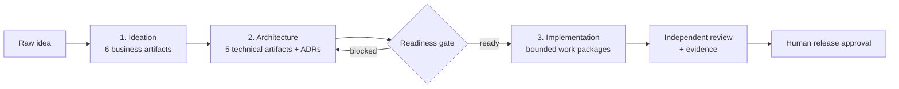

<p align="center">
  
</p>

<p align="center">
  <strong>Agentic Enterprise Guided Intelligent System</strong><br />
  From a one-line idea to approved requirements, an implementable architecture and reviewed code, inside VS Code or Claude Code.
</p>

<p align="center">
  <a href="https://github.com/nishant-tamilselvan/AEGIS/actions/workflows/ci.yml"></a>
  <a href="https://github.com/nishant-tamilselvan/AEGIS/actions/workflows/codeql.yml"></a>
  <a href="https://scorecard.dev/viewer/?uri=github.com/nishant-tamilselvan/AEGIS"></a>
  <a href="LICENSE"></a>
  
  
  
  
</p>

<p align="center">
  <a href="docs/getting-started.md">Getting started</a> ·
  <a href="docs/claude-code.md">Claude Code</a> ·
  <a href="docs/how-it-works.md">How it works</a> ·
  <a href="docs/agents.md">Agents</a> ·
  <a href="docs/cli-reference.md">CLI</a> ·
  <a href="docs/enterprise-standards-setup.md">Enterprise Standards</a> ·
  <a href="docs/troubleshooting.md">Troubleshooting</a>
</p>

---

AEGIS is a set of agents, prompts and skills for GitHub Copilot in VS Code and for Claude
Code, backed by a Python tool layer. Orchestrator agents guide you one small step at a time. Specialist agents write
and maintain a set of living documents. The tooling validates those documents after every
change, so requirements, architecture and code stay consistent.

## Why AEGIS

- **One step at a time.** Orchestrators ask a few focused questions, recap and wait for you.
  You never get a 40-question form.
- **Documents that stay consistent.** Every artifact uses a fixed template and stable ids.
  Validation runs after each edit, and a critic agent fixes what it finds.
- **Grounded in your standards.** Agents check your organization's Enterprise Standards
  first, cite them, and ask only about what they leave open.
- **Bounded, reviewed implementation.** Code is written one approved work package at a time,
  inside declared paths, and completes only with an independent review and recorded evidence.
- **No automatic deployment.** Release needs a named human approver.

## Quick start

```bash
git clone https://github.com/nishant-tamilselvan/AEGIS.git && cd AEGIS
pip install -e .
```

Then open it in your agent host:

| GitHub Copilot | Claude Code |
| --- | --- |
| Open the folder in VS Code and switch Copilot Chat to Agent mode. | Run `claude` in the folder. See [Using AEGIS with Claude Code](docs/claude-code.md). Or install AEGIS into your own repository [as a plugin](docs/claude-code-plugin.md) (preview). |

Start with the same command on either platform:

```text
/start-ideation customer-portal A self-service portal where customers track orders
```

When ideation is done, continue with `/start-architecture customer-portal`, then
`/start-implementation customer-portal <absolute-path-to-target-repo>`.
The [getting started guide](docs/getting-started.md) walks through each phase.

## How it works



| Phase | You get |
| --- | --- |
| **Ideation** | Product, functional and non-functional requirements, a user journey map, a system blueprint and an executive briefing. |
| **Architecture** | Interface specifications with native contracts, data, security, deployment and observability architecture, and ADRs. |
| **Implementation** | Work packages traced to the artifacts, a decision ledger, and reviewed code in your target repository. |

Artifacts live in `docs/artifacts/<app-name>/`, one folder per application. See
[how it works](docs/how-it-works.md) for the artifacts, ids and guarantees, or browse a
**[complete example for a simple to-do app](examples/artifacts/)**: every phase 1 and
phase 2 artifact, an OpenAPI contract and two ADRs, all approved and ready for
implementation.

## What's inside

| | |
| --- | --- |
| **18 agents** | 3 orchestrators and 15 specialists across the three phases. [Catalog](docs/agents.md). |
| **10 prompts** | Slash commands to start, resume, review and change each phase. [List](docs/agents.md#prompts). |
| **2 platforms, 1 source** | Everything is written once in `aegis/` and generated for GitHub Copilot (`.github/`) and Claude Code (`.claude/`). |
| **4 skills** | Artifact, ADR and implementation management, and Enterprise Standards grounding. |
| **2 hooks** | A guard before implementation tool calls, and validation after every edit, on both platforms. |
| **`artifact_tools` CLI** | Scaffold, validate, ADRs, contracts, diagrams and implementation state. [Reference](docs/cli-reference.md). |
| **Reference MCP server** | Serves your standards from Markdown files. [Setup](docs/enterprise-standards-setup.md). |

## Enterprise Standards

Connect your organization's standards, policies, patterns and enterprise decisions through
a read-only MCP server named `enterprise-standards-server`. You can run the included
[reference server](examples/enterprise-standards-server/) on a folder of Markdown files, put
your own server in front of an existing system, or run without one. The
[setup guide](docs/enterprise-standards-setup.md) covers each option.

## Security

The implementation guard is a safeguard, not a sandbox. Review what agents change before
you merge it, and treat standards content as untrusted input. Report vulnerabilities
privately. See [SECURITY.md](SECURITY.md).

## Contributing

Contributions are welcome. See [CONTRIBUTING.md](CONTRIBUTING.md) for the setup, the
checks CI runs and a checklist for each kind of component. This project follows the
[Code of Conduct](CODE_OF_CONDUCT.md). Changes are recorded in the [changelog](CHANGELOG.md).

## License

[MIT](LICENSE)
