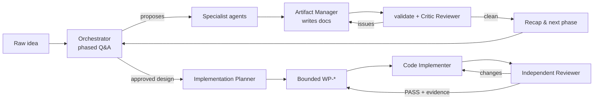

# How AEGIS works

AEGIS turns a raw idea into a specified product, an implementable architecture and then
reviewed code. It runs in GitHub Copilot and in Claude Code, from one set of definitions
in `aegis/`. It works in three phases. In each phase, a user-facing orchestrator agent
talks to you and specialist agents do the detailed work. A Python tool layer keeps the
documents they produce consistent.

## Where it runs

AEGIS runs in two agent hosts. Both use the same agents, rules, hooks and CLI, generated
from `aegis/`:

| | GitHub Copilot (VS Code) | Claude Code |
| --- | --- | --- |
| Orchestrators | Custom agents | The main conversation, started by a slash command |
| Specialists | Custom agents, reached by handoffs | Subagents, reached with the Agent tool |
| Prompts | Prompt files (`/start-ideation` and others) | Slash-command skills with the same names |
| Hooks | `.github/hooks/` | `.claude/settings.json` |
| Standards MCP config | `.vscode/mcp.json` | `.mcp.json` |

See [Using AEGIS with Claude Code](claude-code.md) for the Claude Code details.

## The three phases

| Phase | Orchestrator | Produces |
| --- | --- | --- |
| 1. Ideation | `ideation-orchestrator` | Six business artifacts. |
| 2. Architecture | `architecture-orchestrator` | Five technical artifacts, ADRs and native interface contracts. |
| 3. Implementation | `implementation-orchestrator` | Bounded work packages, a decision ledger and code in a target repository. |

Each phase moves one small step at a time. The orchestrator asks focused questions,
recaps, and waits for your confirmation before it continues.

## The artifacts

Each application gets its own folder, `docs/artifacts/<app-name>/`, so one workspace can
hold several products. Requirement ids are unique within an application.

**Business artifacts (phase 1):**

| Artifact | Ids |
| --- | --- |
| Product requirements | `PR-` |
| Functional requirements | `FR-` |
| Non-functional requirements | `NFR-` |
| User journey map | `UJ-` |
| System blueprint | `BP-` |
| Executive briefing | `RISK-` |

**Technical artifacts (phase 2):**

| Artifact | Ids |
| --- | --- |
| Interface specifications, with contracts in `interfaces/` | `IF-` |
| Data architecture | `DM-` |
| Security architecture | `SEC-` |
| Deployment topology | `DEP-` |
| Observability strategy | `OBS-` |
| Architecture decisions, in `architecture-decisions/` | `ADR-` |

Every artifact is Markdown with YAML frontmatter (`version`, `status`, `last_updated`,
`phase`). Documents refer to each other by stable ids. The
[applications index](artifacts/README.md) describes the layout in detail.

**Implementation state (phase 3)** lives in `docs/artifacts/<app>/implementation/`:

| File | Holds |
| --- | --- |
| `implementation.md` | The canonical pointer: target repository, baseline, active package and release state. |
| `decision.md` | An append-only ledger of tactical `IDEC-*` choices. Material choices become ADRs. |
| `work-packages/WP-NNNN-*.md` | One bounded package each: scope, source versions, target paths, dependencies, acceptance criteria, review and evidence. |

## Who writes what

- Only `artifact-manager` writes artifacts. Other agents propose content to it.
- `adr-author` writes ADRs through the ADR tooling.
- Implementation agents write only the declared target paths of the one active work
  package, and only in the target repository.

## Consistency guarantees

- **Fixed templates.** Every artifact starts from a template, so structure does not drift
  between cycles.
- **Stable ids.** Ids are never reused. See the
  [id conventions](../aegis/skills/artifact-management/references/id-conventions.md).
- **Validation.** `validate` checks frontmatter, id uniqueness and prefixes,
  cross-references, functional-requirement traceability and ADR index integrity.
- **Automatic re-validation.** A `PostToolUse` hook validates after each edit and prompts
  the agent to fix what it broke.
- **Implementation guard.** A `PreToolUse` hook stops code agents from writing artifacts,
  working without an active package or leaving their declared paths. Destructive and
  deployment commands need human approval.
- **Readiness gate.** Implementation will not start from draft artifacts, blocking open
  decisions, missing contracts, proposed ADRs, unknown target conventions or an unverified
  standards review.
- **Evidence-backed completion.** A package completes only with an independent reviewer
  PASS and recorded command results. The final release also needs every source item
  accounted for and a named human approver.

## Standards grounding

Before each phase asks you anything, the agents query your organization's Enterprise
Standards library. They build on what the standards already mandate, cite the standard
ids in the artifacts, and ask you only about what the standards leave open. See
[Enterprise Standards setup](enterprise-standards-setup.md).
