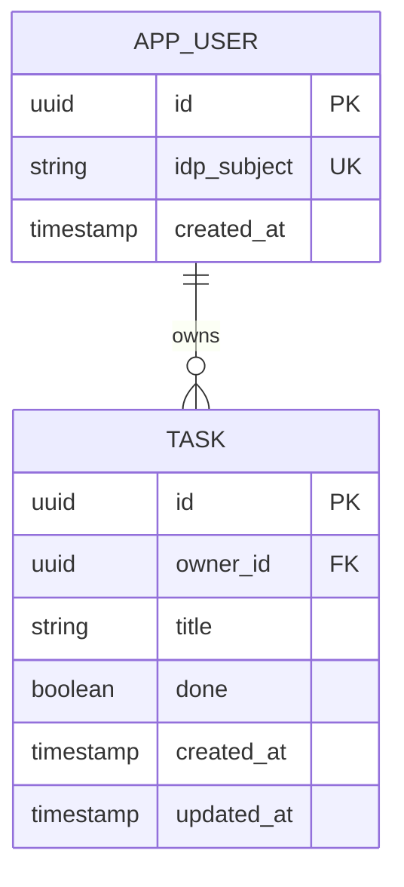

# Data Architecture — Todo List

> How data is structured, owned and governed. Entities use the `DM-` prefix and
> `implements` the functional requirements (`FR-*`) whose data they hold. Proposed by
> `data-architect`, written by `artifact-manager`.

## Legend

- **Store**: `relational` | `document` | `key-value` | `object` | `cache` | `search`
- **Classification**: `public` | `internal` | `confidential` | `pii` | `pci`
- **Status**: `draft` | `in-review` | `approved` | `removed`

## 1. Logical Data Model (ERD)

## 2. Entities

| ID | Entity | Store | Classification | implements | Status |
|------|--------|-------|----------------|------------|--------|
| DM-001 | App user: the identity provider's subject id, and nothing else about the person | relational | pii | FR-001, FR-002 | approved |
| DM-002 | Task: title, done flag and timestamps, owned by one user | relational | confidential | FR-003, FR-004, FR-005, FR-006 | approved |

## 3. Physical Design Notes

- PostgreSQL (ADR-0002). Primary keys are UUIDs generated by the API.
- `app_user.idp_subject` is unique; a user row is created on first sign-in.
- `task.owner_id` references `app_user.id` with `ON DELETE CASCADE`.
- One index on `task (owner_id, done, created_at DESC)` serves the list query (NFR-001).
- `title` is limited to 200 characters by a check constraint as well as by the API.

## 4. Data Retention & Purging

| Data domain | Retention period | Purge mechanism | Driver (NFR/regulation) |
|-------------|------------------|-----------------|-------------------------|
| Tasks | Until the user deletes them | Hard delete after the 5-second undo window | NFR-008 |
| App users | Until the account is deleted | Account deletion cascades to tasks | NFR-008 |
| Backups | 7 days | Managed backup expiry, so deleted data leaves backups within 30 days | NFR-005, NFR-008 |

## 5. Data Sovereignty & Residency

All data stays in the single cloud region the operator chooses at deployment (PR-003).
Backups are kept in the same region. No data is sent to third parties; the identity
provider only receives the sign-in request.

## Changelog

<!-- artifact_tools changelog appends here -->
- 2026-09-24 — v0.1 — Initial scaffold (phase 2).
- 2026-09-24 — v1.0 — Approved at the end of architecture.
