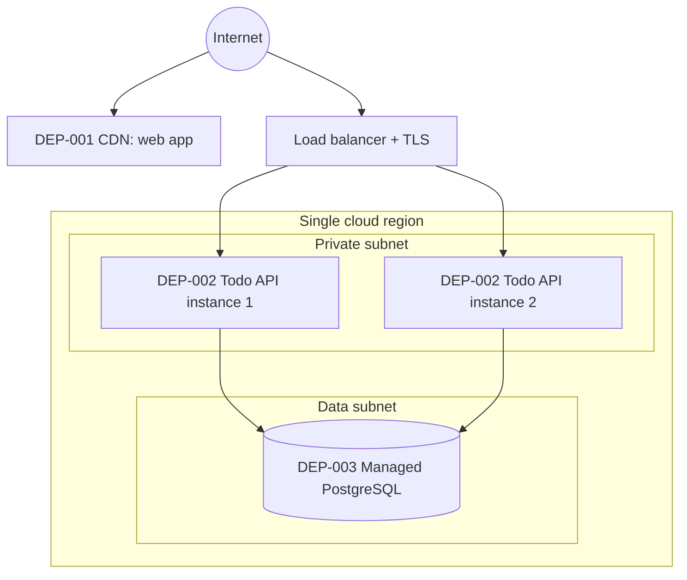

# Deployment Topology — Todo List

> How the software runs in the cloud: networks, environments, and recovery. Nodes use
> the `DEP-` prefix and `mitigates` the operational non-functional requirements
> (`NFR-*`) they address. Proposed by `platform-architect`, written by
> `artifact-manager`.

## Legend

- **Zone**: `public` | `private` | `data` | `management`
- **Status**: `draft` | `in-review` | `approved` | `removed`

## 1. Network Topology

## 2. Topology Nodes

| ID | Node | Zone | Runtime | mitigates | Status |
|------|------|------|---------|-----------|--------|
| DEP-001 | CDN serving the web app's static files | public | static hosting | NFR-001, NFR-004 | approved |
| DEP-002 | Todo API, two instances behind a TLS load balancer | private | container | NFR-001, NFR-004 | approved |
| DEP-003 | Managed PostgreSQL with point-in-time recovery | data | managed database | NFR-003, NFR-005 | approved |

## 3. Environments

| Environment | Purpose | Scale | Promotion gate |
|-------------|---------|-------|----------------|
| Dev | Day-to-day integration | 1 API instance, smallest database | Pull request merged |
| Staging | Release rehearsal, load and accessibility tests | Same as Prod | Tests and checks pass |
| Prod | Real users | 2 API instances | Named approver signs off |

## 4. CI/CD & Infrastructure as Code

- **Pipeline**: build → unit and API tests → dependency and secret scan → container image
  → deploy to Dev.
- **IaC**: Terraform, one module per node, with remote state per environment.
- **Promotion**: the same image moves from Dev to Staging to Prod. Production deploys
  need a named approver and are never automatic.

## 5. Disaster Recovery

| Metric | Target | Implementation |
|--------|--------|----------------|
| RTO | 4 hours | Re-apply Terraform and restore the database from point-in-time recovery |
| RPO | 15 minutes | Continuous write-ahead-log backup of the managed database |

Backups are kept for 7 days in the same region (NFR-008). A restore drill runs every
quarter (NFR-005).

## Changelog

<!-- artifact_tools changelog appends here -->
- 2026-09-24 — v0.1 — Initial scaffold (phase 2).
- 2026-09-24 — v1.0 — Approved at the end of architecture.
