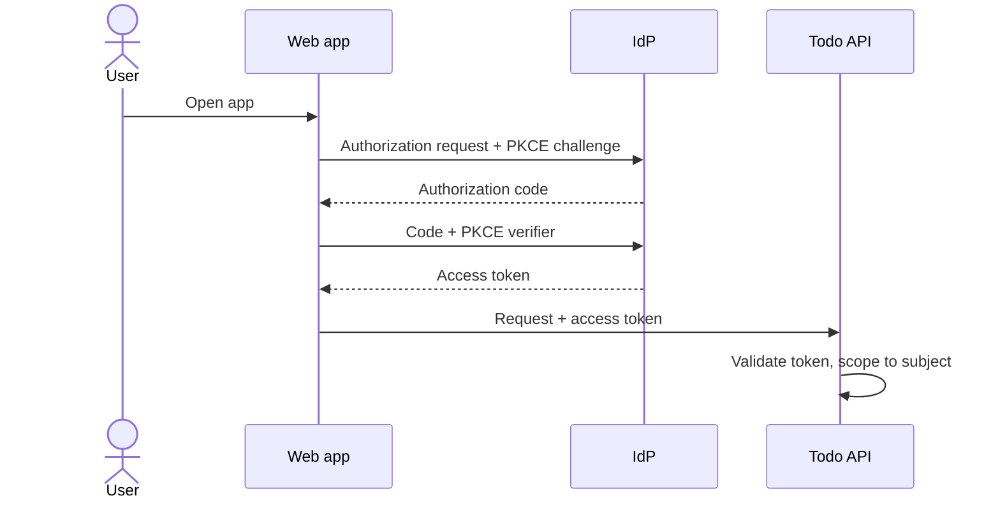
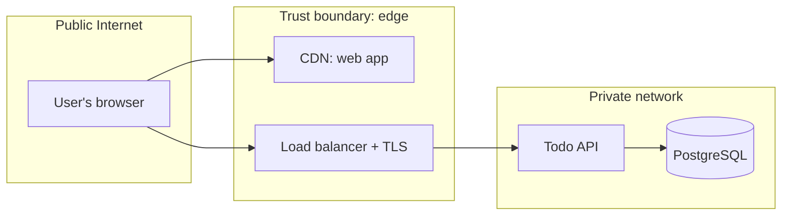

# Security Architecture — Todo List

> Threat model, identity, and data protection. Controls use the `SEC-` prefix and
> `mitigates` the security non-functional requirements (`NFR-*`) they address.
> Proposed by `security-architect`, written by `artifact-manager`.

## Legend

- **Domain**: `iam` | `data-protection` | `network` | `app-sec` | `logging` | `compliance`
- **Status**: `draft` | `in-review` | `approved` | `removed`

## 1. Data Classification

| Data domain | Classification | At rest | In transit |
|-------------|----------------|---------|------------|
| Task titles | confidential | AES-256 (managed database encryption) | TLS 1.2+ |
| User subject ids | pii | AES-256 (managed database encryption) | TLS 1.2+ |

> Classification levels: `public`, `internal`, `confidential`, `pii`, `pci`.

## 2. Identity & Access Management (IAM)

- **Authentication**: OpenID Connect authorization code flow with PKCE, run by the web
  app against the existing identity provider (ADR-0003). The app stores no passwords.
- **Authorization**: one rule, owner only. Every query filters on the token's subject;
  there are no roles.
- **Token handling**: the API validates each access token's signature, issuer, audience
  and expiry. Access tokens last 10 minutes; the web app keeps them in memory, never in
  local storage.

## 3. Trust Boundaries

## 4. Security Controls

| ID | Domain | Control | mitigates | Status |
|------|--------|---------|-----------|--------|
| SEC-001 | iam | OIDC with PKCE for sign-in; the API rejects any token that fails signature, issuer, audience or expiry checks | NFR-002 | approved |
| SEC-002 | app-sec | Every query is scoped to the token's subject; another user's task returns 404 | NFR-002 | approved |
| SEC-003 | data-protection | TLS 1.2+ at the edge and to the database; managed encryption at rest | NFR-003 | approved |
| SEC-004 | app-sec | Titles validated as 1 to 200 characters and rendered as text, never as HTML | NFR-002 | approved |
| SEC-005 | logging | Security events (sign-in failures, rejected tokens, 404s on other users' ids) are logged without task titles | NFR-007 | approved |

## 5. Threat Model (STRIDE summary)

| Threat | Asset | Vector | Control (SEC) |
|--------|-------|--------|---------------|
| Spoofing | User identity | Forged or stolen access token | SEC-001 |
| Tampering | Tasks | Changing another user's task by guessing its id | SEC-002 |
| Repudiation | Security events | Denying a suspicious action | SEC-005 |
| Information disclosure | Task titles | Network sniffing; reading another user's list | SEC-003, SEC-002 |
| Denial of service | Todo API | Request floods | Rate limit at the load balancer |
| Elevation of privilege | Web app | Script injection through a task title | SEC-004 |

## Changelog

<!-- artifact_tools changelog appends here -->
- 2026-09-24 — v0.1 — Initial scaffold (phase 2).
- 2026-09-24 — v1.0 — Approved at the end of architecture.
