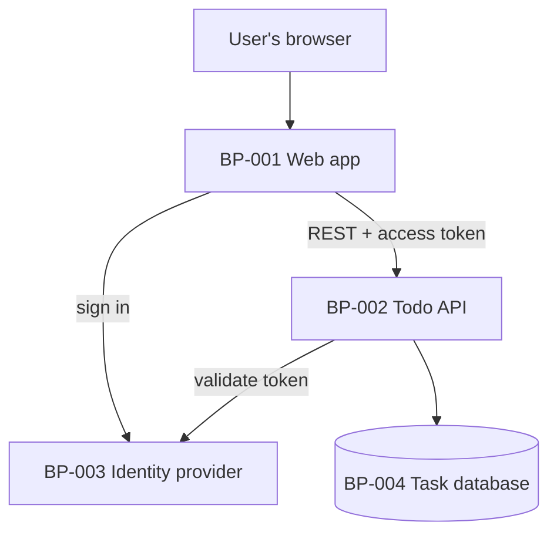

# System Blueprint — Todo List

> Architecture, components, and data flow. Components use the `BP-` prefix and declare
> which functional requirements they `satisfies`. Owned by `architecture` (proposed)
> and written by `artifact-manager`.

## 1. Architecture Overview

## 2. Components

| ID | Component | Responsibility | satisfies | Status |
|------|-----------|----------------|-----------|--------|
| BP-001 | Web app | Single-page app: sign-in redirect, task list, add, rename, complete, delete with undo | FR-001, FR-002, FR-003, FR-004, FR-005, FR-006 | approved |
| BP-002 | Todo API | REST service that validates access tokens and stores each user's tasks | FR-002, FR-003, FR-004, FR-005, FR-006 | approved |
| BP-003 | Identity provider | Existing OpenID Connect provider that signs users in and issues tokens | FR-001 | approved |
| BP-004 | Task database | Managed PostgreSQL holding users and tasks | FR-002, FR-003, FR-004, FR-005, FR-006 | approved |

## 3. Data Flow

1. The web app sends the user to the identity provider, which returns an authorization
   code. The app exchanges it for an access token (see ADR-0003).
2. Every API call carries the access token. The API checks the token and takes the
   user's id from its subject claim.
3. The API reads and writes only rows whose owner is that user.
4. Deleting a task hides it at once. The web app offers undo for 5 seconds before it
   sends the delete request.

## 4. Technology Decisions

| Decision | Choice | Rationale | Alternatives considered |
|----------|--------|-----------|-------------------------|
| Data store | Managed PostgreSQL (ADR-0002) | Relational data, backups and point-in-time recovery included | Document database; SQLite on a volume |
| Sign-in | OIDC authorization code flow with PKCE (ADR-0003) | No passwords stored; works in a browser without a client secret | Own username and password store |
| Web app | Static single-page app | Hosted on a CDN; nothing to run on the server | Server-rendered pages |
| API | Stateless container service | Scales out horizontally and restarts quickly | Serverless functions |

## 5. Cross-cutting Concerns

- **Security:** token validation and owner checks on every request (NFR-002, NFR-003).
- **Reliability:** two API instances and managed database recovery (NFR-004, NFR-005).
- **Performance:** a single indexed query per list call (NFR-001).
- **Observability:** structured logs, golden-signal metrics and tracing (NFR-007).
- **Accessibility:** the web app is keyboard- and screen-reader-friendly (NFR-006).

## Changelog

<!-- artifact_tools changelog appends here -->
- 2026-09-24 — v0.1 — Initial scaffold (phase 1).
- 2026-09-24 — v1.0 — Approved at the end of ideation; decisions confirmed in architecture.
