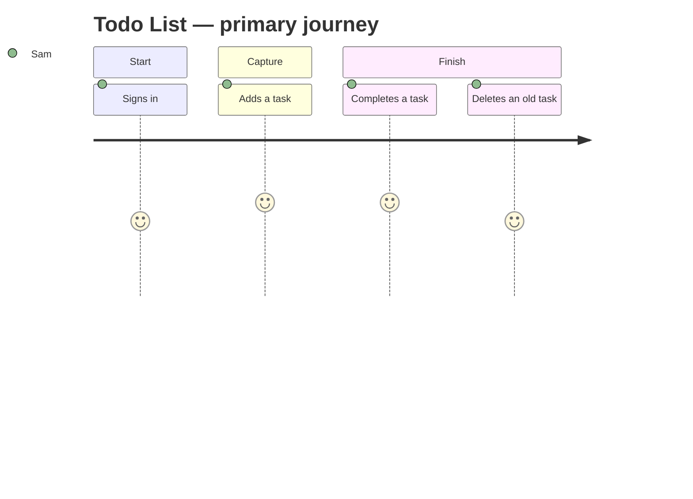

# User Journey Map — Todo List

> Personas and their end-to-end journeys. Journey steps use the `UJ-` prefix and are
> referenced by functional requirements via `traces_to`.

## Personas

| Persona | Description | Primary goal | Pain points |
|---------|-------------|--------------|-------------|
| Sam, busy professional | Juggles small personal and work errands during the day | Write a task down the moment it comes up, and tick it off later | Sticky notes get lost; project tools are too slow for a quick note |

## Journey: Todo List — primary journey

## Journey steps

| ID | Stage | User action | System response | Emotion | Opportunity |
|------|-------|-------------|-----------------|---------|-------------|
| UJ-001 | Start | Opens the app and signs in | Shows Sam's own list, open tasks first | 🙂 | Remember the session so sign-in is rare |
| UJ-002 | Capture | Types a task and presses Enter | Saves it and shows it at the top of the list | 😀 | Keep the input focused so several tasks can be added in a row |
| UJ-003 | Finish | Ticks a task's checkbox | Marks it done and moves it to the Done section | 😀 | Allow reopening a task ticked by mistake |
| UJ-004 | Finish | Deletes a task it no longer needs | Removes it and offers a short undo | 🙂 | Undo prevents accidental loss |

## Changelog

<!-- artifact_tools changelog appends here -->
- 2026-09-24 — v0.1 — Initial scaffold (phase 1).
- 2026-09-24 — v1.0 — Approved at the end of ideation.
